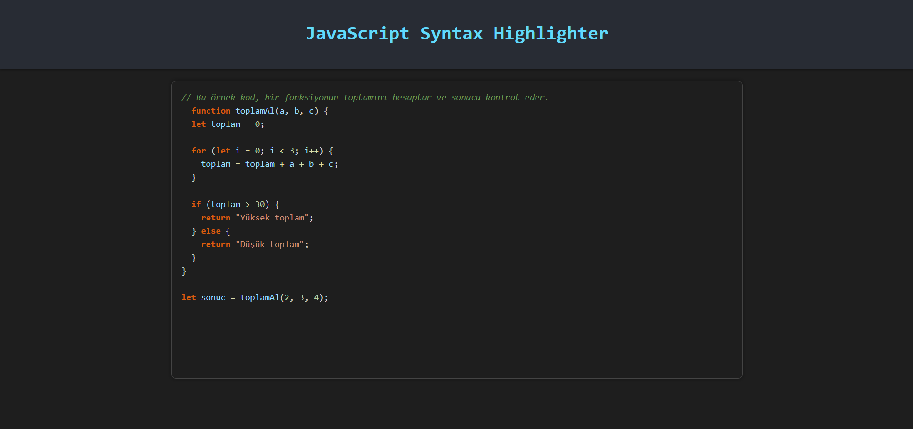
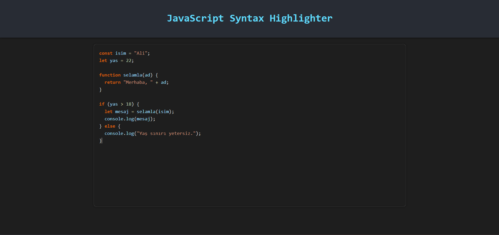
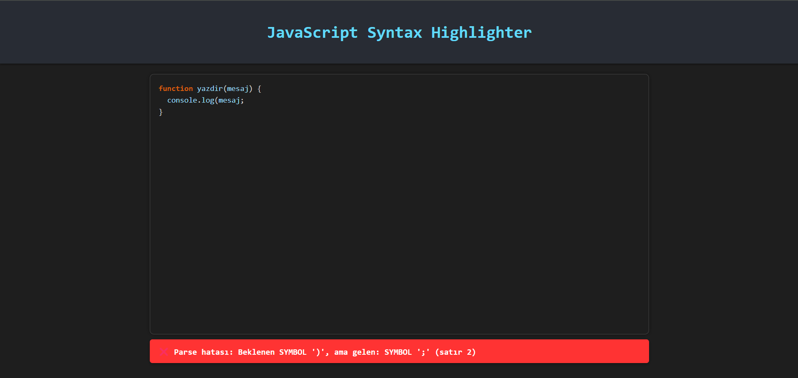

# JavaScript Syntax Highlighter

Bu proje, JavaScript kullanılarak geliştirilmiş, gerçek zamanlı çalışan bir "Syntax Highlighter" yani sözdizimi vurgulama sistemidir. Kullanıcı, tarayıcı üzerinden kod yazarken anlık olarak hem renklendirme yapılır hem de yazılan kodun sözdizimi kontrol edilerek hatalar doğrudan görüntülenir.

[
Projeyi denemek için tıklayabilirsiniz](https://samierz.github.io/Syntax-Higlighter/)

# Desteklenen Yapılar (Parser)

✅ Değişken tanımlama: var, let, const

✅ Koşullu ifadeler: if, else, switch, case, default

✅ Döngüler: for, while, do...while

✅ Fonksiyon tanımı ve çağrısı: function foo() { }, foo()

✅ return ifadeleri

✅ Aritmetik ve mantıksal ifadeler: +, -, *, /, ==, &&, ||

✅ Diziler: [1, 2, 3], [] (index kullanmadan)

 # Ekran Görüntüleri

🔹 Giriş Ekranı

🔹 Kod Renklendirme

🔹 Parse Hatası Görüntüleme

# Teknik Özellikler

## Tokenizer

Regular expression kullanarak token tipi tespiti

Tanımlı token türleri:

- KEYWORD
- IDENTIFIER
- NUMBER
- STRING
- OPERATOR
- SYMBOL
- COMMENT
- WHITESPACE
- ERROR

## Parser

- Elle yazılmış top-down (recursive descent) parser
- Her yapı için ayrı parse fonksiyonları (parseIfStatement, parseFunctionDeclaration vb.)
- Noktalı virgül eksiklikleri, kapanmamış parantezler gibi hatalar yakalanır
- Hatalar satır numarasıyla birlikte gösterilir

## GUI

- HTML + CSS ile VSCode benzeri karanlık tema
- Gerçek zamanlı renklendirme
- ErrorBox ile canlı hata bildirimi

# Canlı Uygulama ve Dosyalar

[📖 Proje Raporu](https://github.com/Samierz/Syntax-Higlighter/blob/main/proje%20raporu.pdf)

[📄 Makale](https://medium.com/@samierznc/real-time-syntax-highlighter-leksikal-analiz-ve-parsing-ile-kod-renklendirme-6ea509368121)

[🎥 Tanıtım Videosu](https://youtu.be/extn2HDl6Bk)

[🌐 Canlı Site ](https://samierz.github.io/Syntax-Higlighter/)

